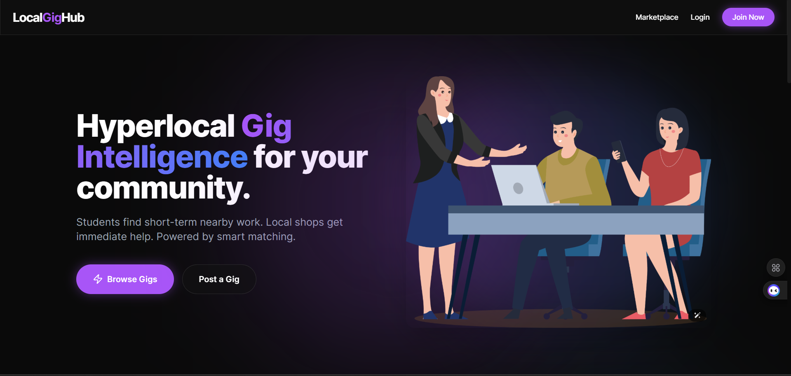
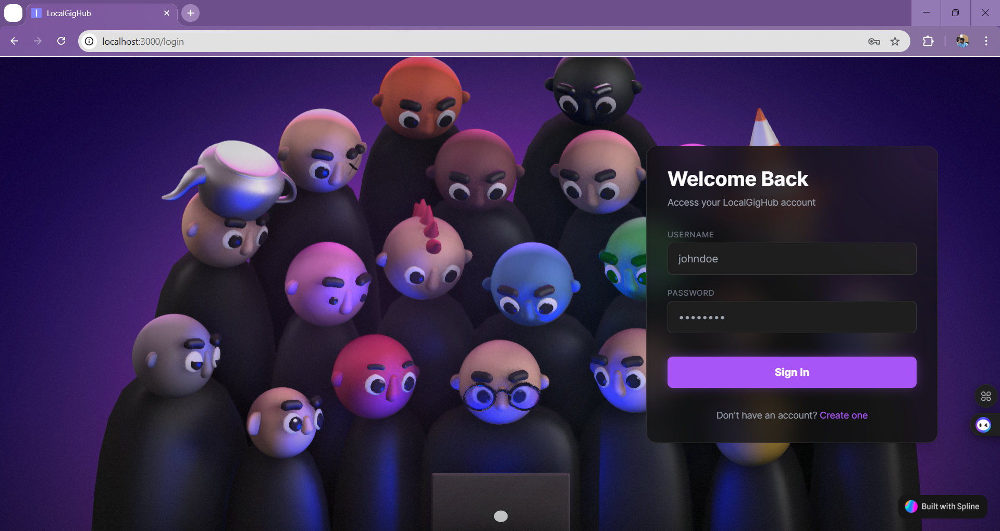
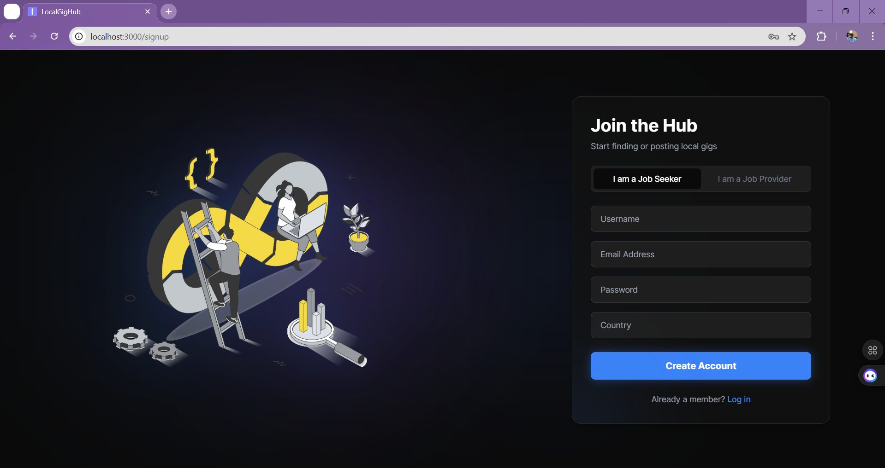
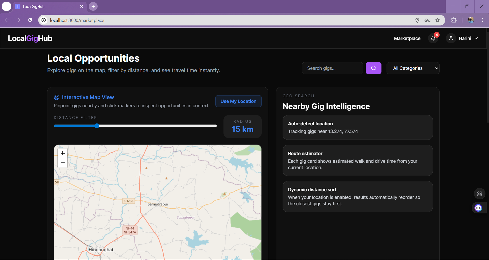
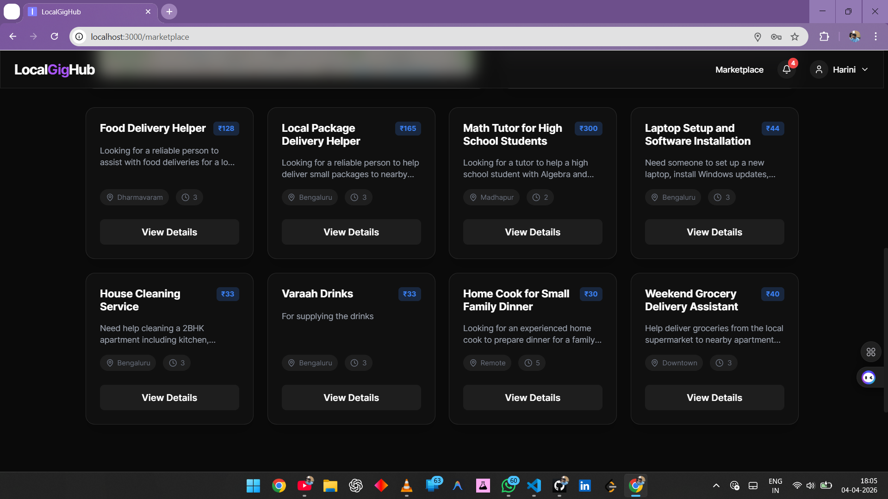
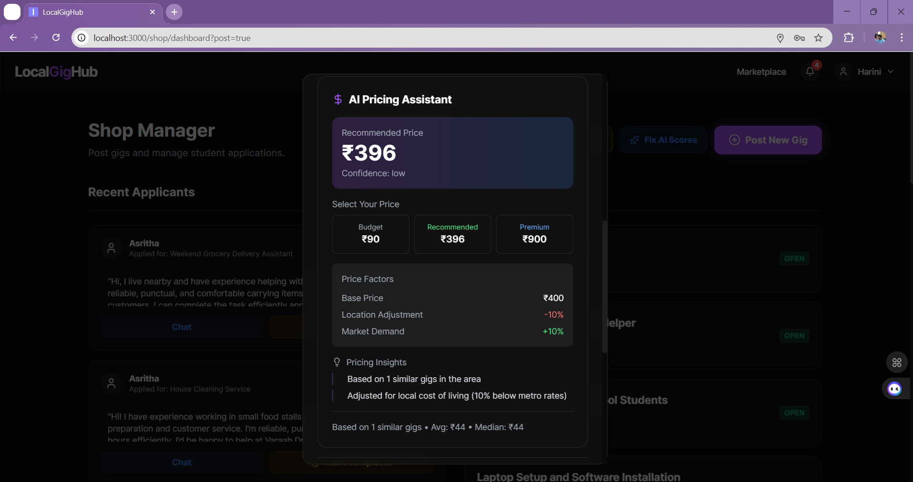
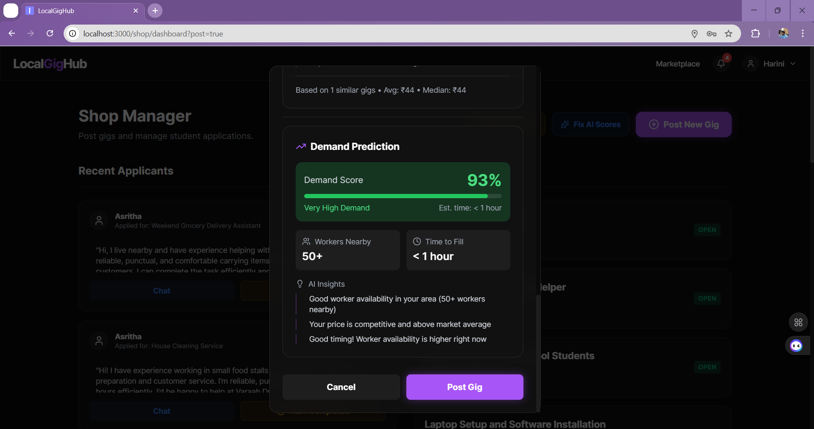
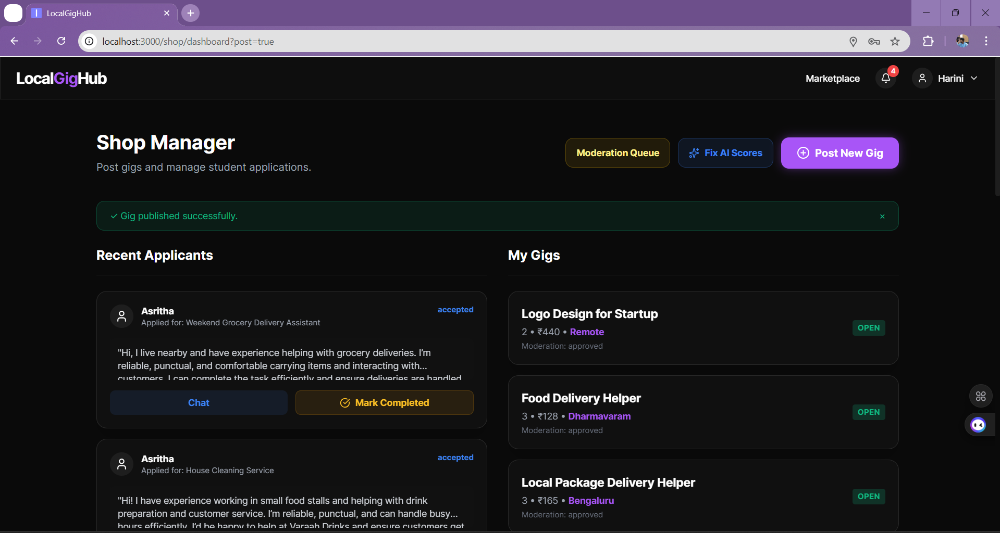

# LocalGigHub

LocalGigHub is a hyperlocal gig marketplace connecting students and local businesses for short-term work, instant communication, and AI-assisted decision support.

## Table of Contents

- [Project Overview](#project-overview)
- [Key Features](#key-features)
- [Screenshots](#screenshots)
- [Tech Stack](#tech-stack)
- [Architecture](#architecture)
- [Project Structure](#project-structure)
- [Getting Started](#getting-started)
- [Environment Variables](#environment-variables)
- [API Modules](#api-modules)
- [Roadmap](#roadmap)
- [Contributing](#contributing)

## Project Overview

LocalGigHub is built for local-first hiring where shops can post gigs and students can discover, apply, and coordinate quickly. The platform includes trust and moderation tools, location-aware matching, and AI utilities for pricing and demand guidance.

## Key Features

- Role-based onboarding and login for job seekers and job providers
- Gig posting and marketplace discovery
- Gig details with apply, report, and block actions
- Shop dashboard for applicant management and gig lifecycle
- Real-time chat for provider and seeker communication
- Notification center with live updates
- Trust and safety workflows, including moderation queue
- AI-assisted tools:
	- Pricing assistant
	- Demand prediction
	- Skill extraction
	- Recommendation and score guidance

## Screenshots

Landing and authentication:





Marketplace and discovery:





Shop dashboard and AI workflow:






Communication:


Note: Place screenshot files inside docs/screenshots using the exact filenames above.

## Tech Stack

- Frontend: React (CRA), Tailwind CSS, Framer Motion, Axios, React Router
- Backend: Node.js, Express.js, Mongoose
- Database: MongoDB
- Authentication: JWT with cookie-based sessions
- Realtime: Server-Sent Events for notifications
- Maps and location: Leaflet, React Leaflet

## Architecture

```text
React Client (client/) -> Express API (server/) -> MongoDB
																		|
																		+-> AI modules (pricing, demand, skills, recommendations)
																		|
																		+-> SSE notifications and chat workflows
```

## Project Structure

```text
LocalGigHub/
	client/   React frontend
	server/   Express backend
	docs/     Documentation and screenshot assets
```

## Getting Started

1. Clone repository

```bash
git clone https://github.com/CHETHCODEX/LocalGigHub.git
cd LocalGigHub
```

2. Install and run backend

```bash
cd server
npm install
npm start
```

3. Install and run frontend

```bash
cd ../client
npm install
npm start
```

Default local URLs:

- Frontend: http://localhost:3000
- Backend: http://localhost:8000

## Environment Variables

Create a file at server/.env:

```env
MONGO=your_mongodb_connection_string
JWT_KEY=your_jwt_secret
```

## API Modules

- Auth: /api/auth
- Users: /api/users
- Gigs: /api/gigs
- Applications: /api/applications
- Chat: /api/chat
- Notifications: /api/notifications
- Reviews: /api/reviews
- AI: /api/ai

## Roadmap

- Improve moderation automation and safety scoring
- Expand analytics for providers and students
- Add richer reputation and review experiences
- Add mobile-oriented notification enhancements

## Contributing

Contributions are welcome through issues and pull requests. For major changes, open an issue first with context and expected outcomes.
